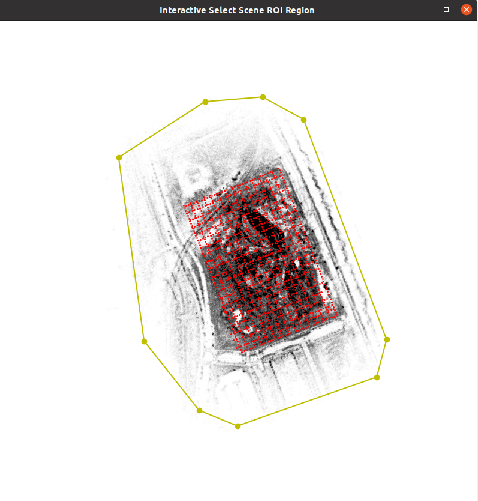
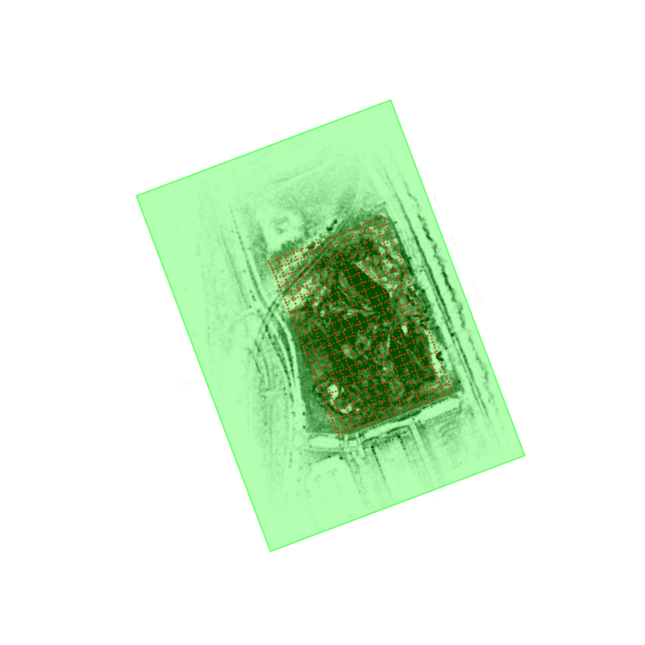
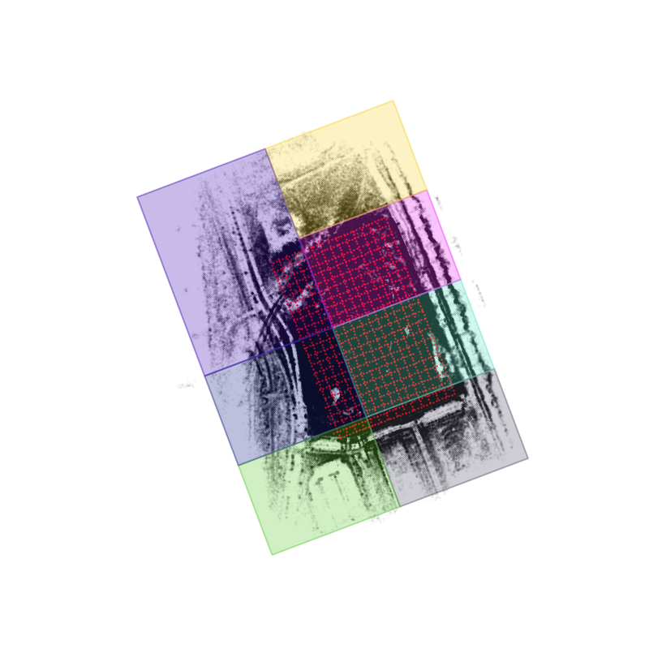

<h1 style="text-align:center">BlockGaussian: Efficient Large-Scale Scene Novel View Synthesis via Adaptive Block-Based Gaussian Splatting</h1>

## [Project Page](https://sunshinewyc.github.io/BlockGaussian/) | [Paper]()

## Introduction
This repository is the official implement of BlockGaussian, a novel framework incorporating a content-aware scene partition strategy and visibility-aware block optimization to achieve efficient and high-quality large-scale scene reconstruction. BlockGaussian reconstructs city-scale scenes from massive multi-view images and enables high-quality novel view synthesis from arbitrary viewpoints, as illustrated in the surrounding images. Compared to existing methods, our approach reduces reconstruction time from hours to minutes while achieving superior rendering quality in most scenes.

<div align="center">
    
</div>

<div align="center">
  <table style="border-collapse: collapse; border-spacing: 0; margin: 0; padding: 0;">
    <tr>
      <td style="padding: 2px;"></td>
      <td style="padding: 2px;"></td>
    </tr>
    <tr>
      <td style="padding: 2px;"></td>
      <td style="padding: 2px;"></td>
    </tr>
  </table>
</div>

## Method Overview
<div align="center">
    
</div>

## Environment Installation
### Clone the repository
```shell
# SSH
git clone git@github.com:SunshineWYC/BlockGaussian.git
```
or
```shell
# HTTPS
git clone https://github.com/SunshineWYC/BlockGaussian.git
```

### Check the requirements
#### Hardware Requirements
- CUDA-ready GPU with Compute Capability 7.0+
- 24 GB VRAM (to train to paper evaluation quality)

#### Software Requirements
- Conda (recommended for easy setup)
- C++ Compiler for PyTorch extensions
- CUDA SDK 11 for PyTorch extensions, we use 12.1
- C++ Compiler and CUDA SDK must be compatible


### Install the environment of BlockGaussian.
``` shell
conda env create --file environment.yml
conda activate blockgaussian
```

## Scene reconstruction
### 1. Dataset Preprocess
#### Preprocess Mill-19 dataset and UrbanScene3D dataset
1. Download the dataset of Mill19 dataset and UrbanScene3D dataset follow [MegaNeRF](https://github.com/cmusatyalab/mega-nerf?tab=readme-ov-file#data)
2. Estimate camera extrinsic with COLMAP, or directly use the camera parameters generated by [CityGaussian](https://github.com/cmusatyalab/mega-nerf?tab=readme-ov-file#data)
3. Reorganize the ```scene``` dataset fold like
```
├── data
│   matrix_city_aerial
│   │   ├── train
│   │   │   ├── images
│   │   │   ├── sparse
│   │   │   │   ├── 0
│   │   │   │   │   ├── cameras.bin
│   │   │   │   │   ├── points3D.bin
│   │   │   │   │   ├── images.bin
│   │   ├── test
│   │   │   ├── images
│   │   │   ├── sparse
│   │   │   │   ├── 0
│   │   │   │   │   ├── cameras.bin
│   │   │   │   │   ├── images.bin
│   │   │   │   │   ├── points3D.bin
│   ├── matrix_city_street
│   │   ├── train
│   │   ├── val
│   ├── building
│   │   ├── train
│   │   ├── val
│   ├── residence
│   │   ├── train
│   │   ├── val
│   ├── rubble
│   │   ├── train
│   │   ├── val
│   ├── sciart
│   │   ├── train
│   │   ├── val
```

#### Preprocess MatrixCity dataset
1. Download the [MatricCity](https://github.com/city-super/MatrixCity) dataset. Select `small_city` version
2. Preprocess the dataset following the [CityGaussian](https://github.com/cmusatyalab/mega-nerf?tab=readme-ov-file#data)

#### Preprocess costumed dataset
1. Prepare multi view images and save in `your_scene/images`
2. Estimate parameters with COLMAP, and save Structure from Motion result in `your_scene/sparse`

### 2. Estimate depth maps of training-views(Optional)
1. Download DepthAnythingV2 checkpoints and put it under `preprocess/Depth-Anything-V2/checkpoints`
2. Estimate depth maps and depth-aligning parameters
``` shell
python preprocess/estimate_depth_and_rescale.py -s datasets/scene_dirpath
```

### 3. Configure the yaml file
Create `scene_name.yaml` under `configs` folder and configure the setting. The meaning of the parameters are noted as follows:
```
### scene params ###
scene_dirpath: ./datasets/building/train    # scene data dirpath
output_dirpath: ./output/building           # output folder
white_background: false                     # background color of the scene
sh_degree: 3                                # max spherical harmonics degree
evaluate: false                             # split evaluate views for train_eval_split=False scene
scene_scale: 1.0                            # rescale ratio of entire scene
image_scale: 0.25                           # rescale ratio of training image

### scene partition params ###
expand_ratio: 0.05                          # scene partition param, block boundary expanding ratio
vertical_axis: "y"                          # scene partition param, vertical axis
max_tree_depth: 2                           # scene partition param, max bitree depth when partition the scene
num_points_thresh: 300000                   # scene partition param, block split condition
cover_ratio_thresh: 0.3                     # scene partition param, view assignment thresh, 0-1

### training params ###
num_workers: 8                              # number workers when loading data
batch_size: 1                               # batch size during training
preload: "cpu" # "cpu" / "none"             # preload or not
iterations: 40000                           # iteration of each block
position_lr_init: 0.00016                   # initial 3D position learning rate
position_lr_final: 0.0000016                # final 3D position learning rate
position_lr_delay_mult: 0.01                # position learning rate multiplier
position_lr_max_steps: None                 # number of learning rate steps, if None, equal to iterations
feature_lr: 0.0025                          # spherical harmonics features learning rate
opacity_lr: 0.025                           # opacity learning rate
scaling_lr: 0.005                           # scaling learning rate
rotation_lr: 0.001                          # rotation learning rate
random_background: false                    # flag to use random background during training
lambda_dssim: 0.2                           # influence of SSIM on photometric loss
depth_l1_weight_init: 1.0                   # initial weight of depth_inv loss 
depth_l1_weight_final: 0.1                  # final weight of depth_inv loss
reproj_l1_weight_init: 0.01                 # initial weight of pseudo-view loss
reproj_l1_weight_final: 0.5                 # final weight of pseudo-view loss
depth_inv_loss: true                        # flag to use depth_inv loss
pesudo_loss: true                           # flag to use pseudo-view loss
pesudo_loss_start: 5000                     # start iteration of pseudo-view loss


### densify and prune params ###
percent_dense: 0.01                         # percentage of scene extent (0-1) a point must exceed to be forcibly densified
densify_grad_threshold: 0.0002              # limit that decides if points should be densified
densification_interval: 200                 # how frequently to densify
densify_from_iter: 1000                     # iteration where densification starts
densify_until_iter: None                    # iteration where densification stops, if None, equal to iterations//2
opacity_reset_interval: None                # how frequently to reset opacity, if None, equal to iterations//10
min_opacity: 0.005                          # opacity thresh when pruning
densify_only_in_block: true                 # flag to densify only in block

### rendering paramss ###
convert_SHs_python: false
compute_cov3D_python: false
debug: false
antialiasing: false
```


### 4. Scene partition and view assignment
Divide the scene and assign relevant perspectives to each block with the following command.
``` shell
python scene_partition.py -c ./configs/scene_name.yaml
```

Interactively draw a convex polygon to select region of interest in the pop-wp window, press `Enter` to automatically connect the start and end points.
<div align="center">
    
</div>

The scene partition info file `blocks_info.yaml` and visulization results `ROI_region.png` `Partition_Results.png` are outputed in `output/scene_name` folder.
<div align="center">
    <table>
    <tr>
        <td></td>
        <td></td>
    </tr>
    </table>
</div>

### 5. Training
Supports sequential execution on a single GPU device and parallel training on multiple GPUs.
* Training on single GPU. For scenes with multiple blocks, reconstruct the scene sequentially.
```shell
python train.py -c ./configs/scene_name.yaml
```

&emsp;**--config / -c** : config file path

&emsp;**--blocks_id / -b** : block ids need to reconstruction


* Training on multi-GPU platform

```shell
python parallel_train.py -c scene_name.yaml --num_blocks 7 --num_gpus 4
```
&emsp;**--config / -c** : config file path

&emsp;**--num_blocks** : the number of blocks of the scene

&emsp;**--num_gpus** : the number of gpus of platform


### 6. Postfix and merge block results
Postfix individual block reconstruction results and merge to fetch the entire scene gaussian plyfile.
```shell
python block_fusion.py -o ./output/scene_name --merge
```
&emsp;**--optimized_path / -o** : the directoy path the results are stored

&emsp;**--merge** : flag to merge all block result to get `point_cloud_merged.ply`


## Render views
### Render train/test views
To render the views of datasets or with given camera params. The rendered result with be outputed in `output/scene_name/render` folder.
```shell
python render_views.py -o ./output/scene_name --train_eval_split --eval_only
```
&emsp;**--optimized_path / -o** : the directoy path the results are stored

&emsp;**--train_eval_split** : flag refers to train and eval views are stored separately

&emsp;**--eval_only** : flag to render eval views only


### Interactive Rendering

Using SIBR_Viewer to interactively render the novel views. For the installation and use of SIBR_Viewer, refer to [3DGS](https://github.com/graphdeco-inria/gaussian-splatting#interactive-viewers).


## Evaluation
Calculate metrics of rendered results.
```shell
python metrics.py -o ./output/scene_name --train_eval_split --eval_only
```
&emsp;**--optimized_path / -o** : the directoy path the results are stored

&emsp;**--train_eval_split** : flag refers to train and eval views are stored separately

&emsp;**--eval_only** : flag to evaluate eval views only


## Citation
If you find this code useful for your research, please use the following BibTeX entry.
```
@misc{wu2025blockgaussianefficientlargescalescene,
      title={BlockGaussian: Efficient Large-Scale Scene Novel View Synthesis via Adaptive Block-Based Gaussian Splatting}, 
      author={Yongchang Wu and Zipeng Qi and Zhenwei Shi and Zhengxia Zou},
      year={2025},
      eprint={2504.09048},
      archivePrefix={arXiv},
      primaryClass={cs.CV},
      url={https://arxiv.org/abs/2504.09048}, 
}
```
